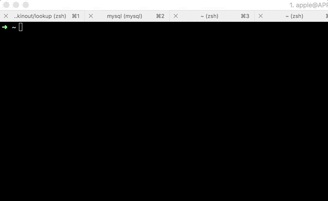

## LookNS

<p align="center">
    
</p>

### Inspiration
I used to forget the commands to dig the IP from Hostname and the Hostname from IP, so I decided to make a short and simple wrapper around the same. Also wanted to learn Node's dns API.

## Installation

```
npm install -g lookns
```

## Usage

* To get IP from Hostname
```
lookns -i amazon.com
```

* To get Hostnames from IP
```
lookns -r -i 205.251.242.103
```

<!--  -->
<p align="center">
    
</p>

Please feel free to open issues and pull requests.
Also if you liked it, please feel free to star and share.